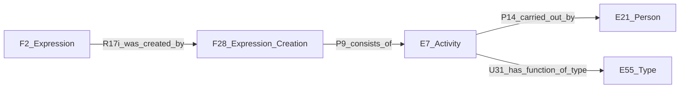

# SHERLOCK-GRIST-TO-CRM

Il y a trois types de données :

## Métadonnées de mapping Grist → CRM

Les métadonnées permettant d'exploiter les conventions utilisées dans les colonnes des tables Grist. Ce sont des types (`crm:E55_Type`) de titres (`crm:E35_Title`), d'appellation (`crm:E41_Appellation`), d'identifiants (`crm:E42_Identifier`) et d'annotations (`crm:P177_assigned_property_of_type`), ainsi que les prédicats RDF non CRM utilisés.

## Données d'administration des projets

Les liste des projets, personnes, collections et fichiers des projets.

## Données utilisateurs des tables Grist

Les données des tables Grist, pour lesquelles chaque ligne donne lieu à la création d'une ressource identifiée par un UUID. Pour chacune de ces ressources, il faut pouvoir spécifier :

- quel est le `rdf:type` des ressources (éventuellement avec une surcharge par ligne via une colonne `rdf:type`) ;
- à quelle `sherlock:collection` appartiennent (`sherlock:hasMember`) les ressources ;
- les différents types métiers que doit recevoir la ressource (des `crm:E55_Type` liés à la ressource par le prédicat `crm:P2_has_type`) ;
- s'il y a des annotations `crm:E13_Attribbute_Assignment`, quels en sont les auteurs (des `crm:E21_Person` via la prédicat `crm:P14_carried_out_by`) ;
- le projet (`crm:E7_Activity`) dans le contexte duquel (`sherlock:has_context_project`) la ressource a été produite ;
- si nécessaire, comment générer (à partir de quelles colonnes) un `rdfs:label`.

## Points techniques

- Le graphe dans lequel iront les données est hors du périmètre de sherlock-grist-to-crm, qui ne génère que des triplets et non des quads.

## Mapper les patterns spécifiques du CIDOC CRM

### Modèle de composition de DOREMUS

Le modèle [DOREMUS](https://data.doremus.org/ontology/) (basé sur une ancienne version de [LRMoo](https://cidoc-crm.org/lrmoo/fm_releases)) génère beaucoup de sous-entités pour établir des faits comme : 

- https://repository.ifla.org/rest/api/core/bitstreams/29ee4904-34e2-4ee7-a129-3bebda2f369b/content#page=12
- https://data.doremus.org/ontology/img/model.composition.png

