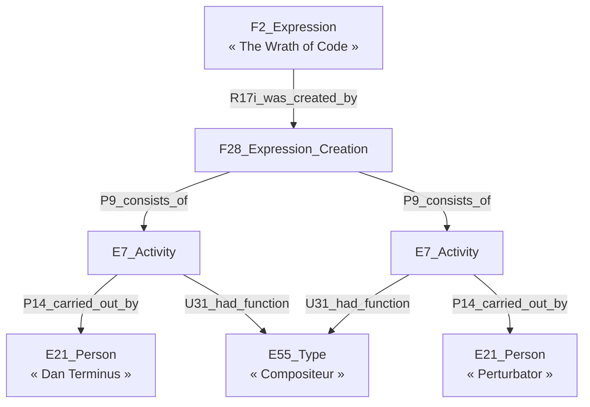

# 🔮 Mapper les patterns spécifiques du CIDOC CRM

## 🧑‍🎤 Modèle de composition de DOREMUS

Le modèle [DOREMUS](https://data.doremus.org/ontology/) (basé sur une ancienne
version de [LRMoo](https://cidoc-crm.org/lrmoo/fm_releases)) génère beaucoup de
sous-entités pour établir des faits comme : « Dan Terminus et Perturbator ont
composé _The Wrath of Code_. ». Le modèle de composition est illustré
[ici](https://data.doremus.org/ontology/img/model.composition.png) et
[là](https://repository.ifla.org/rest/api/core/bitstreams/29ee4904-34e2-4ee7-a129-3bebda2f369b/content#page=12).
Il repose sur l'idée qu'une expression (F2) résulte d'un événement de création
(F28) qui agrège l'ensemble des activités (E7) qui établissent les différents
rôles tenus dans la création de l'expression.

🗃️🧑‍🎤 Table des `E21_Person` :

| Colonnes              | Item 1       | Item 2      |
| --------------------- | ------------ | ----------- |
| `UUID`                | `UUID-1`     | `UUID-2`    |
| `P1_is_identified_by` | Dan Terminus | Perturbator |

🗃️🎶 Table des `F2_Expression` :

| Colonnes                           | Colonnes (API)             | Item 1                                                       |
| ---------------------------------- | -------------------------- | ------------------------------------------------------------ |
| Identifiant de la F2               | `UUID`                     | `UUID-3`                                                     |
| Titre de la F2                     | `P1_is_identified_by`      | The Wrath of Code                                            |
| Identifiant du F28 de la F2        | `0SE_F280_UUID`            | `UUID-4`                                                     |
| Fonction de la 1ère  E7 | `0SE_E7a_U31_had_function` | [`aat:300025671`](http://vocab.getty.edu/page/aat/300025671) |
| Auteur de la 1ère E7    | `0SE_E7a_P14`              | `UUID-1`                                                     |
| UUID de la 1ère E7      | `0SE_E7a_UUID`             | `UUID-5`                                                     |
| Fonction de la 2ème  E7 | `0SE_E7b_U31_had_function` | [`aat:300025671`](http://vocab.getty.edu/page/aat/300025671) |
| Auteur de la 2ème E7    | `0SE_E7b_P14`              | `UUID-2`                                                     |
| UUID de la 2ème E7      | `0SE_E7b_UUID`             | `UUID-6`                                                     |

Cette approche convient quand on a un nombre « raisonnable » de E7 rattachés au F28, et qu'il est possible de créer un jeu de colonne pour chacun d'entre eux. Dans le cas où ce nombre de E7 pourrait être important et non déterminable en amont, ils devraient être définis dans une table à part.