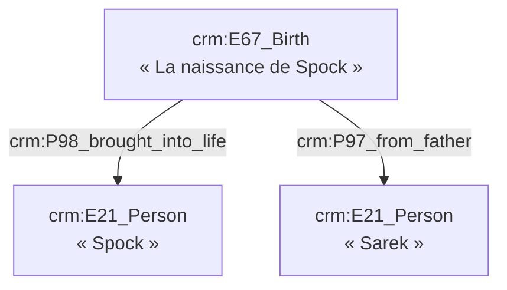
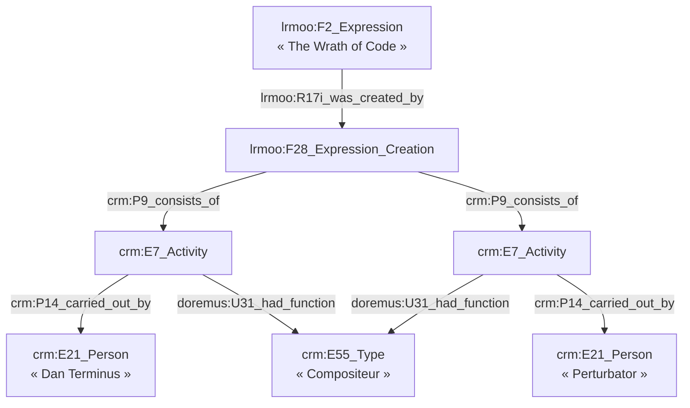

# 🔮 Mapper les patterns spécifiques du CIDOC CRM

## Conventions

## Problématique

Le CRM génère beaucoup de sous-entités. Par exemple, si on veut exprimer le nom du père d'une personne, cela doit passer par une instance de la classe `crm:E67_Birth` :

Mais dans une interface tabulaire, on aimerait simplement saisir les données de cette façon :

| Nom   | Nom du père |
| ----- | ----------- |
| Spock | Sarek       |

## 🧑‍🎤 Modèle de composition de DOREMUS

Le modèle [DOREMUS](https://data.doremus.org/ontology/) (basé sur une ancienne
version de [LRMoo](https://cidoc-crm.org/lrmoo/fm_releases)) génère beaucoup de
sous-entités pour établir des faits comme : « Dan Terminus et Perturbator ont
composé _The Wrath of Code_. ». Le modèle de composition est illustré
[ici](https://data.doremus.org/ontology/img/model.composition.png) et
[là](https://repository.ifla.org/rest/api/core/bitstreams/29ee4904-34e2-4ee7-a129-3bebda2f369b/content#page=12).
Il repose sur l'idée qu'une expression (F2) résulte d'un événement de création
(F28) qui agrège l'ensemble des activités (E7) qui établissent les différents
rôles tenus dans la création de l'expression.

### 🗃️🧑‍🎤 Table de `E21_Person`

| Colonnes              | Record 1     | Record 2          |
| --------------------- | ------------ | ----------------- |
| `UUID`                | `UUID-1`     | `UUID-2`    <tr/> |
| `P1_is_identified_by` | Dan Terminus | Perturbator <tr/> |

### 🗃️🎶 Table de `F2_Expression`

| Colonnes                          | Colonnes (API)                    | Record 1                                                     | À cacher à l'utilisateur ? | Note    |
| --------------------------------- | --------------------------------- | ------------------------------------------------------------ | :------------------------: | ------- |
| Identifiant                       | `UUID`                            | `UUID-3`                                                     |             ✅              | <tr/>   |
| Titre                             | `P1_is_identified_by`             | The Wrath of Code                                            |                            | <tr/>   |
| Identifiant du F28                | `R17i___F280a0`                   | `UUID-4`                                                     |             ✅              | ♈ <tr/> |
| 1ère E7                | `F280a0___P9_consists_of___E70a0` | `UUID-5`                                                     |             ✅              | ♊ <tr/> |
| Fonction de la 1ère E7 | `E70a0___U31_had_function`        | [`aat:300025671`](http://vocab.getty.edu/page/aat/300025671) |                            | <tr/>   |
| Auteur de la 1ère E7   | `E70a0___P14_carried_out_by`      | `UUID-1`                                                     |                            | <tr/>   |
| 2ème E7                | `F280a0___P9_consists_of___E70a0` | `UUID-6`                                                     |             ✅              | ♊ <tr/> |
| Fonction de la 2ème E7 | `E70a0___U31_had_function`        | [`aat:300025671`](http://vocab.getty.edu/page/aat/300025671) |                            | <tr/>   |
| Auteur de la 2ème E7   | `E70a0___P14_carried_out_by`      | `UUID-2`                                                     |                            | <tr/>   |

♈ On exprime ici que la `F2` est connectée à une `F28` via `R17i`. On définit l'UUID de la sous-entité `F28` souhaité dans la cellule.
 
♊ On exprime ici que les `E7` sont connectés à la `F28` via `P9`. On définit les UUID des sous-entité `E7` souhaités dans la cellule.

<!--

-->

Cette approche convient quand on a un nombre « raisonnable » de E7 rattachés au F28, et qu'il est possible de créer un jeu de colonnes pour chacun d'entre eux. Dans le cas où ce nombre de E7 pourrait être important et non déterminable en amont, ils devraient être définis dans une table à part.